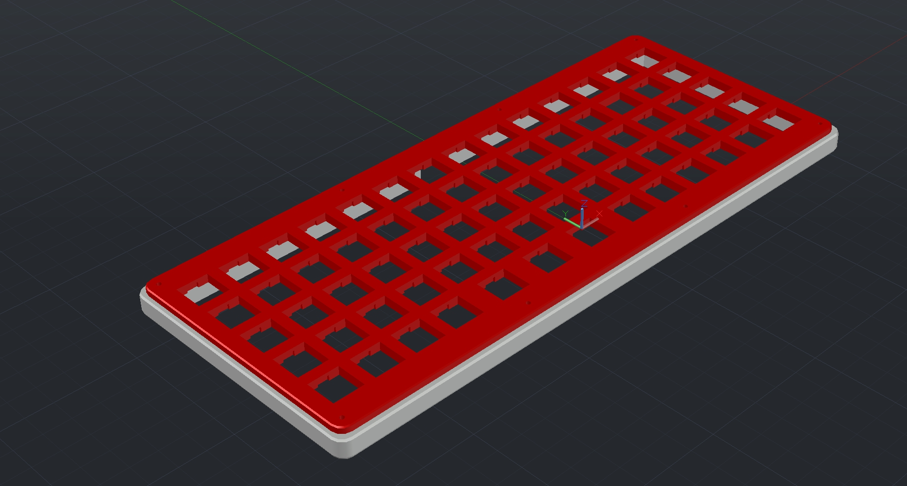
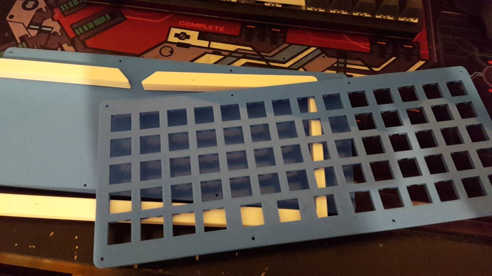
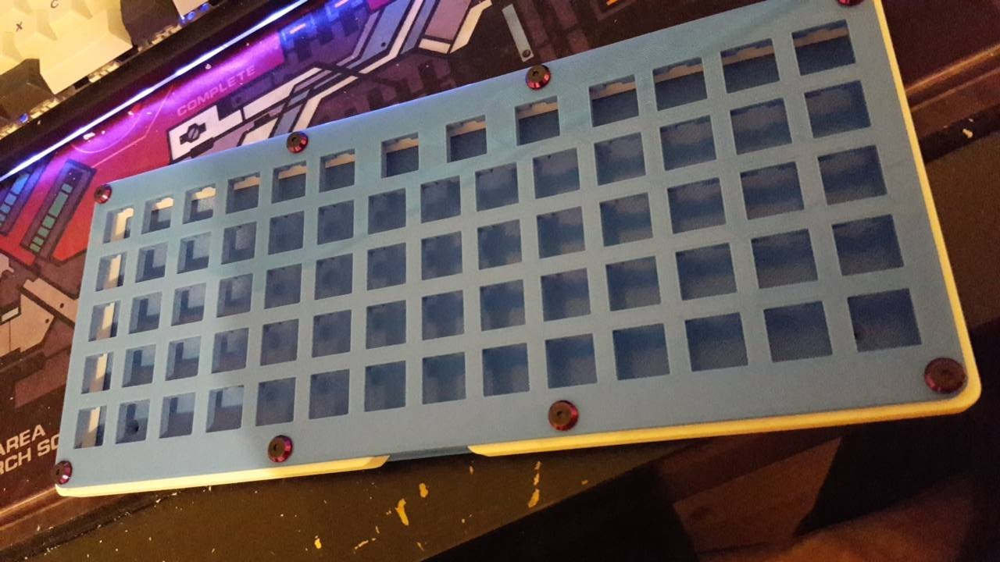
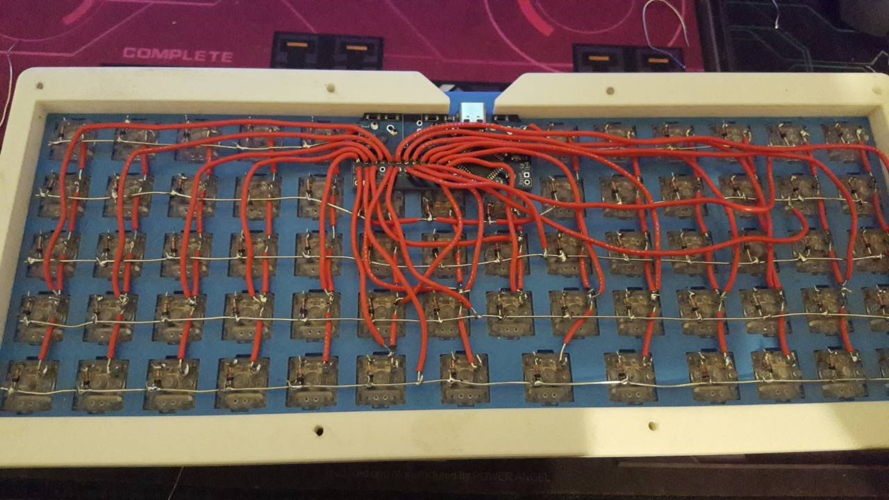
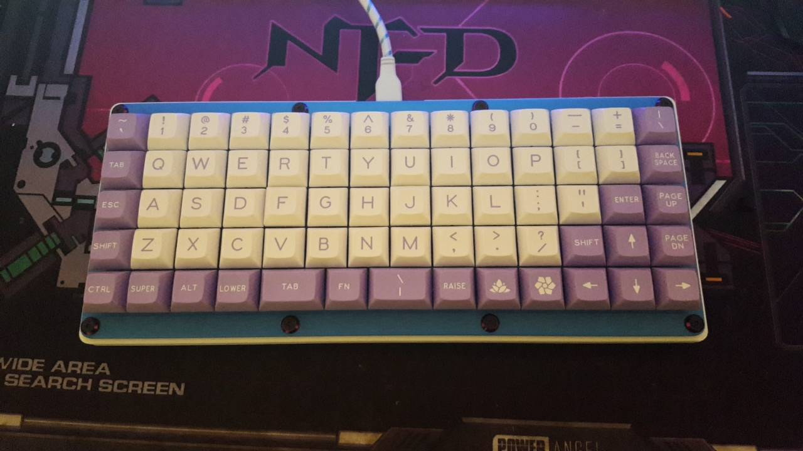

# reeeeboard
5x14 handwired ortho

	- Postage Board
	- Zealios r8 67g
	- 3D printed case 
	- Depending on 3d print tolerances, screw holes might be too small for m3 screws and need to be widened
	- 4mm thick plate with cutouts for clipping switches in

	- [WIP] Angled feet for slant
	- Case slightly warped after fitting in switches
	
	
	
	Case Render
	
	
	Case Parts
	
	
	Test Fit
	
	
	Wired
	
	
	Done